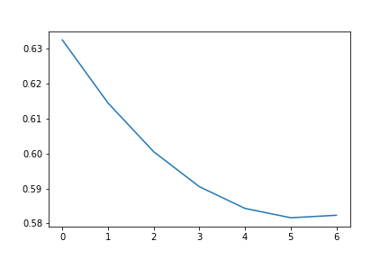

# Pneumonia Detection from x-ray images

## General Overview
This repository contains a Python implementation of a Convolutional Neural Network (CNN) for classifying chest X-ray images into two categories: pneumonia-positive and pneumonia-negative. The network consists of multiple layers, including convolutional, max-pooling, and fully connected (dense) layers. Implemented entirely from scratch using numpy.

## Dataset
The dataset used for training and evaluation consists of chest X-ray images collected from different sources. It is divided into two classes: pneumonia-positive and pneumonia-negative.

## Model Architecture
The CNN model used for pneumonia classification has the following architecture:

1. Convolutional Layer: Applies a set of learnable filters to the input image to detect local features.
2. Max-Pooling Layer: Reduces the spatial dimensions of the feature maps, reducing computation and extracting dominant features.
3. Flatten Layer: Flattens the 3D feature maps into a 1D vector for input to the fully connected layer.
4. Fully Connected (Dense) Layer: A fully connected layer with sigmoid activation to produce the final classification probability.

## Loss curve

## Results

Training Accuracy: 74.29

Testing Accuracy: 59.77

## Training Link
https://www.kaggle.com/code/tapaskd123/makes-sense-mean-1?scriptVersionId=52788655

